DOSSIER DE PROJET

Horizon B2B - Intégration SSO & Module de Facturation

RNCP 39765 - Bloc 2 : Manager les projets numériques

Épreuve E2 - Mise en situation professionnelle reconstituée

| Rôle | Membre | Responsabilités principales |
| --- | --- | --- |
| Chef de Projet (CP) | Chef de Projet | Cadrage, planning, pilotage global, reporting COPIL |
| Développeur (DEV) | Développeur | Architecture technique, dev API/SSO, gestion incidents |
| Analyste (ANA) | Analyste | Risques, KPI, budget, revues de performance, RETEX |

Date de remise livrables : 22 mai 2025   |   Soutenance : 3 juillet 2025   |   Promotion 2025-2026

# LIVRABLE 1 - Note de cadrage & Charte projet

Responsable : Chef de Projet (CP)   |   Contributions : Analyste (parties prenantes, contraintes)

## 1.1 Contexte et enjeux

La DSI de TechPartner SA exploite depuis 2018 un portail B2B monolithique (PHP/MySQL) utilisé par 140 partenaires actifs pour soumettre et suivre leurs commandes. Les délais de traitement atteignent en moyenne 6,2 jours, bien au-delà de la cible sectorielle de 5 jours. L'architecture actuelle ne permet plus d'évoluer sans risque de régression.

Le sponsor (Directeur de la DSI) a validé en janvier 2025 un budget et une roadmap pour une refonte complète intégrant une API REST, un SSO centralisé et un module de facturation automatisée.

| Enjeu | Description | Mesure de succès | Priorité |
| --- | --- | --- | --- |
| Performance | Réduire de 20 % le délai de traitement des demandes partenaires | Délai moyen ≤ 5,0 j (vs 6,2 j actuel) | CRITIQUE |
| Sécurité | Centraliser l'authentification via SSO (OAuth2/OIDC) | 0 compte orphelin à M+4 | HAUTE |
| Automatisation | Module facturation : génération et envoi automatiques | 100 % des factures auto-générées | HAUTE |
| Budget | Tenir l'enveloppe de 32 351 € validée par le COMEX | CPI ≥ 0,90 à chaque jalon | HAUTE |
| Délai | Première MEP à M+4 (30 juin 2025) - impératif sponsor | Go/NoGo validé à M+4 | CRITIQUE |

## 1.2 Périmètre

### Dans le périmètre (IN)

- Refonte complète du front-end portail partenaires (React 18)

- Développement et exposition des API REST (commandes, statuts, facturation) : Node.js / Express

- Intégration du module SSO via protocole OAuth2/OIDC (Keycloak)

- Module de facturation automatisée avec export PDF et envoi email

- Tests unitaires, d'intégration et recette fonctionnelle

- Documentation technique et guide utilisateur partenaires

### Hors périmètre (OUT)

- Migration des données historiques antérieures à janvier 2023

- Refonte du back-office interne DSI (phase 2 : post M+4)

- Déploiement multi-pays / multi-devises

- Application mobile partenaires

## 1.3 Hypothèses & Contraintes

| Type | Description | Impact potentiel | Mesure prise |
| --- | --- | --- | --- |
| Hypothèse | Les partenaires disposent d'un accès HTTPS stable et d'un navigateur récent (2022+) | Faible | Guide de prérequis envoyé à J-10 |
| Hypothèse | L'environnement de dev/recette est disponible dès J+5 (validé avec l'infra) | Moyen | Confirmation écrite infra reçue |
| Hypothèse | Le fournisseur SSO Keycloak est déjà licencié par l'entreprise | Moyen | Vérifié en séance de cadrage |
| Contrainte | Budget de 32 351 € non révisable : toute dérive > 5 % nécessite un arbitrage sponsor | Fort | Suivi CPI hebdomadaire |
| Contrainte | MEP M+4 (30 juin 2025) non négociable - engagement contractuel partenaires | Critique | Jalon Go/NoGo à M+3 S2 |
| Contrainte | Conformité RGPD obligatoire pour toutes les données partenaires traitées | Fort | Checklist RGPD intégrée à la DoD |
| Contrainte | Équipe de 3 personnes : disponibilité CP à 60 %, DEV à 100 %, ANA à 70 % | Moyen | WBS ajusté aux capacités réelles |

## 1.4 Parties prenantes

| Partie prenante | Rôle | Attentes principales | Niveau d'influence | Mode d'engagement |
| --- | --- | --- | --- | --- |
| Directeur DSI (Sponsor) | Commanditaire & décideur budget | ROI, tenue délai M+4, rapport mensuel | Très fort | COPIL mensuel |
| Chef de Projet | Pilotage opérationnel | Clarté du périmètre, outils disponibles | Fort | COPROJ hebdo + daily |
| Développeur | Réalisation technique | Specs stables, environnement fonctionnel | Fort | Daily + sprint |
| Analyste | Analyse, risques, KPI | Accès aux données de production | Moyen | COPROJ hebdo |
| Partenaires B2B (140) | Utilisateurs finaux | UX fluide, rapidité, stabilité | Moyen | Test utilisateur M+2 |
| Équipe Sécurité DSI | Validation SSO & RGPD | Conformité, audit trail | Moyen | Revue à chaque jalon |
| Comptabilité | Validation module facturation | Exactitude, traçabilité, export comptable | Faible | UAT à M+3 |

## 1.5 Cartographie des parties prenantes - Grille influence / intérêt

### Matrice influence / intérêt

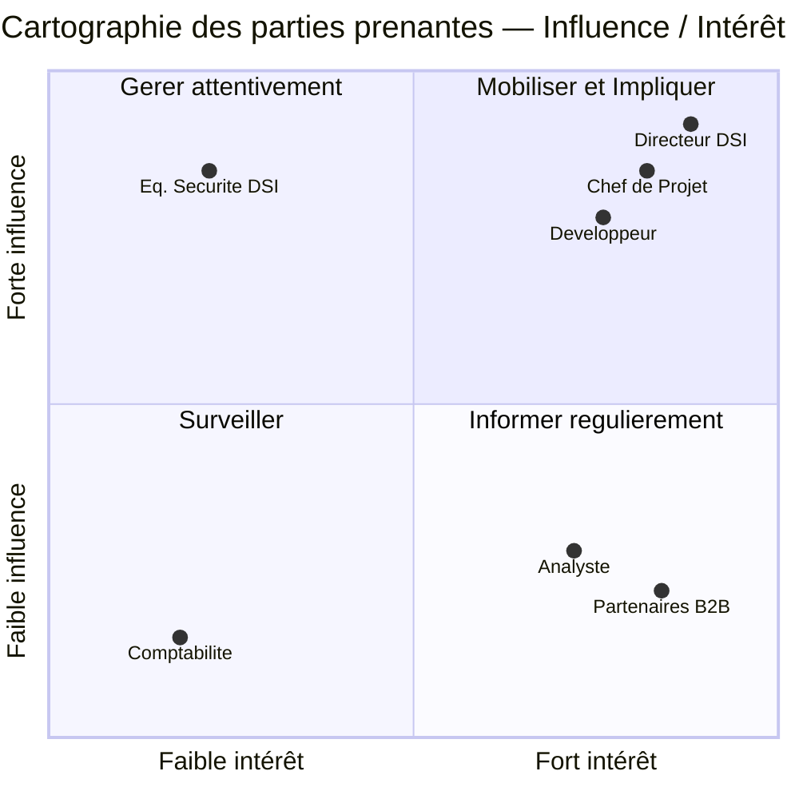

★ = parties prenantes prioritaires

| Partie prenante | Quadrant | Stratégie d'engagement | Fréquence | Canal |
| --- | --- | --- | --- | --- |
| Directeur DSI (Sponsor) | Mobiliser & Impliquer | Décisions stratégiques, validation budget & MEP, escalades | Mensuel (COPIL) | Rapport COPIL + réunion présentielle |
| Chef de Projet | Mobiliser & Impliquer | Pilotage quotidien, coordination équipe, arbitrages périmètre | Quotidien | Daily + COPROJ hebdo |
| Développeur | Mobiliser & Impliquer | Réalisation technique, levée des blocages, décisions archi | Quotidien | Daily + Sprint ceremonies |
| Partenaires B2B (140) | Informer régulièrement | Validation UX (5 pilotes à M+2), feedback recette UAT à J3 | M+2 (test pilotes) + J3 (UAT) | Email + sessions de test |
| Analyste | Informer régulièrement | Suivi KPI, registre risques, rapports COPIL | Hebdomadaire | COPROJ + outils Jira |
| Équipe Sécurité DSI | Gérer attentivement | Validation SSO & RGPD aux jalons J1 et J3 | Ponctuel (jalons) | Revue technique planifiée |
| Comptabilité | Surveiller | Validation module facturation (UAT M+3), format export CSV | Ponctuel (M+3) | Email + PV de recette |

### Plan de communication

| Destinataire | Objet | Fréquence | Format | Émetteur |
| --- | --- | --- | --- | --- |
| Sponsor (DSI) | Rapport d'avancement COPIL (SPI, CPI, risques, jalons) | Mensuel (J+30, J+60, J+90, J+120) | Document structuré + présentation 20 min | CP + ANA |
| Équipe projet | PV COPROJ (décisions, actions, blocages) | Hebdomadaire (lundi 9h) | Document horodaté, dépôt Confluence | CP |
| Équipe projet | Mise à jour Kanban Jira + statut quotidien | Quotidien | Board Jira + 3 réponses daily (hier / aujourd'hui / blocage) | Chaque membre |
| Partenaires pilotes | Invitation test utilisateur M+2 | Unique à M+2 | Email + guide de test | ANA |
| Partenaires pilotes | Convocation UAT | Unique à M+3 | Email + scénarios de test | ANA |
| Équipe Sécurité DSI | Demande de revue SSO/RGPD | Ponctuel (J1 + J3) | Email + accès au dépôt de recette | CP |
| Comptabilité | Convocation UAT facturation | Unique à M+3 | Email + cas de test facturation | ANA |

## 1.6 Gouvernance du projet

| Instance | Fréquence | Participants | Objectif | Livrable |
| --- | --- | --- | --- | --- |
| COPIL | Mensuel (J+30, J+60, J+90, J+120) | Sponsor, CP, ANA | Décisions stratégiques, budget | Rapport d'avancement COPIL |
| COPROJ | Hebdomadaire (lundi 9h) | CP, DEV, ANA | Suivi opérationnel, levée des blocages | PV de réunion horodaté |
| Daily stand-up | Quotidien (9h15, 15 min max) | CP, DEV, ANA | Synchronisation quotidienne | Mise à jour Kanban Jira |
| Sprint Planning | J1 de chaque sprint (2 sem.) | CP, DEV, ANA | Sélection et estimation des stories | Sprint backlog validé |
| Sprint Review | Dernier jour de chaque sprint | Équipe + Sponsor (si dispo) | Démo, feedback, validation | Backlog mis à jour |
| Sprint Rétrospective | Après chaque Review (30 min) | CP, DEV, ANA | Amélioration continue process | Plan d'actions RETEX |

## 1.7 Matrice RACI

R = Responsible (réalise)   |   A = Accountable (garant)   |   C = Consulté   |   I = Informé

| Activité / Livrable | Chef de Projet | Développeur | Analyste | Sponsor |
| --- | --- | --- | --- | --- |
| Note de cadrage & charte | A/R | C | C | I |
| Matrice RACI | A/R | I | C | I |
| WBS & estimation charges | A | C | R | I |
| Planning Gantt / roadmap | A/R | C | C | I |
| Registre des risques | A | C | R | I |
| Budget prévisionnel | A | C | R | A |
| Architecture technique | I | A/R | C | I |
| Développement API REST | I | A/R | I | I |
| Intégration SSO Keycloak | I | A/R | C | I |
| Module de facturation | I | A/R | C | I |
| Backlog & User Stories | A | R | C | I |
| Tableau Kanban (suivi) | C | R | A | I |
| Tests unitaires & intégration | I | A/R | C | I |
| Recette fonctionnelle UAT | A | C | R | I |
| Tableau de bord KPI | A | C | R | I |
| Revues de performance | R | C | A/R | C |
| Rapports COPIL | A/R | I | C | A |
| Journal d'incidents | A | R | C | I |
| Plan montée en compétences | A | R | C | I |
| Mise en production | A/R | R | C | A |

# LIVRABLE 2 - WBS, Planning & Budget prévisionnel

Responsable : Chef de Projet (CP)   |   Contributions : Développeur (estimations techniques), Analyste (budget, risques)

## 2.1 Work Breakdown Structure (WBS)

Le projet est décomposé en 5 lots principaux, chacun découpé en sous-livrables assignés à un responsable unique.

| Lot | Sous-livrable | Description | Resp. | Charge (j/h) | Durée |
| --- | --- | --- | --- | --- | --- |
| L1 - Cadrage & Gouvernance | 1.1 Note de cadrage | Contexte, périmètre, contraintes, RACI | CP | 2 | 3 j |
| L1 - Cadrage & Gouvernance | 1.2 Registre risques initial | Identification, cotation, plans de réponse | ANA | 1,5 | 2 j |
| L1 - Cadrage & Gouvernance | 1.3 Budget prévisionnel | Estimation charges, coûts, réserves | ANA | 1 | 1 j |
| L2 - Architecture & Dev | 2.1 Architecture & specs API | Schéma, contrats d'interface, tech stack | DEV | 4 | 5 j |
| L2 - Architecture & Dev | 2.2 Développement API REST | Endpoints commandes, statuts, partenaires | DEV | 8 | 10 j |
| L2 - Architecture & Dev | 2.3 Intégration SSO Keycloak | OAuth2/OIDC, gestion des rôles et tokens | DEV | 7 | 9 j |
| L2 - Architecture & Dev | 2.4 Module de facturation | Génération PDF, envoi email, historique | DEV | 6 | 8 j |
| L2 - Architecture & Dev | 2.5 Front-end React | Portail partenaires, tableau de bord | DEV | 5 | 7 j |
| L3 - Tests & Recette | 3.1 Tests unitaires | Jest (front) + Pytest (back) - cov. > 70 % | DEV | 4 | 5 j |
| L3 - Tests & Recette | 3.2 Tests d'intégration | Scénarios end-to-end Cypress | DEV | 3 | 4 j |
| L3 - Tests & Recette | 3.3 Recette fonctionnelle UAT | Validation avec représentants partenaires | ANA | 3 | 4 j |
| L4 - Pilotage | 4.1 Reporting & COPIL | Rapports mensuels, tableaux de bord KPI | CP + ANA | 4 | Continu |
| L4 - Pilotage | 4.2 Gestion des risques | Mise à jour registre, plans correctives | ANA | 2 | Continu |
| L4 - Pilotage | 4.3 Coordination équipe | Daily, COPROJ, PV, décisions | CP | 3 | Continu |
| L5 - Déploiement & Clôture | 5.1 MEP production | Déploiement, tests de fumée, monitoring | DEV + CP | 2 | 2 j |
| L5 - Déploiement & Clôture | 5.2 Documentation | Guide tech., guide utilisateur partenaires | DEV + ANA | 2 | 3 j |
| L5 - Déploiement & Clôture | 5.3 Bilan de projet | RETEX final, rapport de clôture | CP + ANA | 1 | 1 j |

### Vue arborescente du WBS

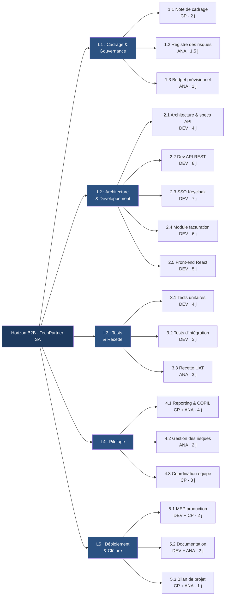

### Architecture système - Vue d'ensemble

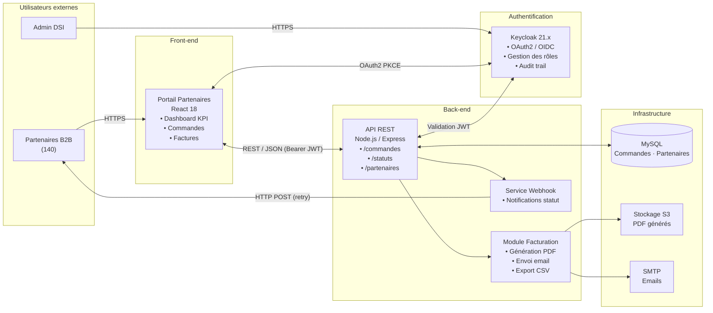

## 2.2 Jalons & chemin critique

| # | Jalon | Livrable(s) associé(s) | Date cible | Resp. | Statut |
| --- | --- | --- | --- | --- | --- |
| J0 | Lancement officiel du projet | Note de cadrage validée, RACI, budget | 02/03/2025 | CP | OK |
| J1 | Architecture validée | Schéma API, choix stack, specs SSO | 28/03/2025 | DEV | OK |
| J2 | Livraison Dev M1 | API REST + SSO fonctionnels en recette | 25/04/2025 | DEV | VIGILANCE |
| J3 | Recette UAT validée | PV de recette signé, go partenaires | 06/06/2025 | ANA | PARTIEL |
| J4 | MEP Go/NoGo | Mise en production validée | 30/06/2025 | CP | PARTIEL |

Note sur J2 : Un retard de 3 jours sur l'intégration SSO (incident INC-001 - voir L6) a été absorbé par anticipation. Le jalon J2 est repoussé au 28/04/2025 mais reste dans la marge de flottement du chemin critique.

### Planning Gantt

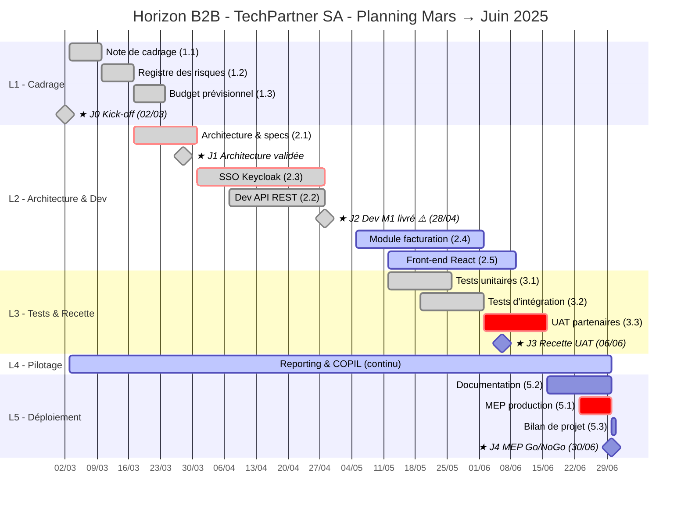

**Légende :**

| Style | Signification |
|:-----:|:-------------|
| Barres grises | Tâches terminées (`done`) |
| Barres bleues | Tâches en cours (`active`) |
| Barres rouges | Chemin critique (`crit`) |
| Losanges ★ | Jalons (`milestone`) |

Chemin critique : L1.1 Note de cadrage → J0 → L2.1 Architecture → J1 → L2.3 SSO Keycloak → J2 → L3.3 UAT → J3 → L5.1 MEP → J4

Flottement disponible : lot API REST = 3 jours · lot Front-end = 5 jours · lot Tests unitaires = 3 jours

## 2.3 Budget prévisionnel et suivi

| Poste de charge | Quantité | TJM (€) | Budget prévu (€) | Réalisé à date (€) | Écart (€) |
| --- | --- | --- | --- | --- | --- |
| Chef de Projet | 15 j/h | 450 €/j | 6 750 | 4 050 | + 0 (en cours) |
| Développeur | 28 j/h | 500 €/j | 14 000 | 9 500 | - 500 (retard INC-001) |
| Analyste | 12 j/h | 430 €/j | 5 160 | 3 010 | + 0 (en cours) |
| Licences & outils (Jira, SonarQube, Keycloak) | - | - | 1 500 | 1 500 | 0 |
| Infrastructure (serveurs recette + prod) | - | - | 2 000 | 1 200 | + 800 (budget non consommé) |
| Réserve pour aléas (10 %) | - | - | 2 941 | 800 (INC-001) | + 2 141 |
| TOTAL |  |  | 32 351 | 20 060 | CPI = 0,97 |

Lecture du CPI : CPI = 0,97 → pour chaque euro dépensé, 0,97 € de valeur est produite. Situation saine, légèrement sous-performante sur le lot DEV en raison de l'incident SSO. Aucun arbitrage de périmètre nécessaire à ce stade.

## 2.4 Plan qualité

Responsable : Chef de Projet (CP)   |   Contributions : Développeur (outils techniques), Analyste (critères acceptation)

### Critères d'acceptation du projet (niveau projet au-delà de la DoD story)

| Dimension | Critère | Outil de mesure | Seuil d'acceptation | Responsable vérification |
| --- | --- | --- | --- | --- |
| Performance | Délai moyen de traitement des demandes partenaires | Mesure dans le portail (logs) | ≤ 5,0 jours (réduction de 20 % vs 6,2 j actuel) | ANA |
| Disponibilité | Uptime du portail B2B en production | Monitoring (UptimeRobot) | ≥ 99,5 % sur 30 jours glissants | DEV |
| Sécurité | Zéro compte orphelin après intégration SSO | Audit Keycloak realm | 0 compte orphelin à M+4 | Équipe Sécurité DSI |
| Couverture tests | Tests unitaires + intégration | Rapport Jest CI/CD + Cypress | Couverture ≥ 70 % sur tous les nouveaux fichiers | DEV |
| Qualité code | Duplications, code smells, vulnérabilités | SonarQube | Duplications < 8 % · 0 vulnérabilité critique | DEV |
| Facturation | 100 % des factures auto-générées à la validation de commande | Tests fonctionnels UAT | 100 % des scénarios de recette validés | ANA + Comptabilité |
| RGPD | Conformité sur toutes les données personnelles partenaires | Checklist RGPD DoD + revue DPO | 100 % des stories données personnelles cochées | ANA |

### Processus de revue qualité

| Étape | Moment | Type de revue | Participants | Livrable produit |
| --- | --- | --- | --- | --- |
| Revue d'architecture | J1 (28/03) | Revue technique | DEV + CP + Équipe Sécurité DSI | PV revue architecture signé |
| Revue de code collaborative | Bimensuelle (S2, S4, S6…) | Pair review, pull request | DEV + ANA + CP | PR approuvée, commentaires GitHub |
| Gate qualité CI/CD | À chaque merge sur `main` | Automatique (SonarQube + Jest) | Automatisé | Rapport CI/CD, blocage si seuil non atteint |
| Recette fonctionnelle UAT | J3 (06/06) | Test utilisateur avec partenaires | 5 partenaires pilotes + ANA | PV de recette signé |
| Revue sécurité RGPD | J3 (06/06) | Audit | Équipe Sécurité DSI + ANA | Rapport de conformité |
| Go/NoGo MEP | J4 (30/06) | Décision collégiale | CP + DEV + ANA + Sponsor | Décision Go/NoGo horodatée |

### Outils qualité utilisés

| Outil | Usage | Seuil configuré |
| --- | --- | --- |
| Jest (front-end) | Tests unitaires React + auth.service | Couverture ≥ 70 % : pipeline bloquant |
| Pytest (back-end) | Tests unitaires API Node.js | Couverture ≥ 70 % : pipeline bloquant |
| Cypress | Tests d'intégration E2E (flux OAuth2, soumission commande, génération facture) | 100 % des scénarios critiques passants |
| SonarQube | Qualité du code : duplications, code smells, vulnérabilités | Duplications < 8 % · 0 vulnérabilité CRITICAL |
| GitHub Actions (CI/CD) | Pipeline automatique à chaque PR + merge | Blocage si Jest/Pytest < 70 % ou SonarQube fail |
| Jira | Suivi des bugs (filtre BUG + sévérité) | Alerte si > 2 bugs HAUTE/CRITIQUE ouverts |

### Critères Go/NoGo MEP (J4 - 30/06/2025)

| Critère | Valeur requise | Statut actuel | Décision si non atteint |
| --- | --- | --- | --- |
| Toutes les stories MUST livrées | 100 % | En cours (S3) | Blocage MEP, arbitrage sponsor |
| Couverture tests ≥ 70 % | ≥ 70 % | 73 % | / |
| 0 bug CRITIQUE ouvert | 0 | 0 à ce stade | Correction obligatoire avant MEP |
| PV recette UAT signé | Signé | Planifié 29/05 | MEP reportée si non signé |
| Validation sécurité RGPD | Validée | Planifiée J3 | Blocage MEP |
| CPI ≥ 0,90 | ≥ 0,90 | 0,97 | Information sponsor si < 0,90 |

# LIVRABLE 3 - Registre des risques

Responsable : Analyste (ANA)   |   Contributions : Développeur (risques techniques), Chef de Projet (risques planning/budget)

Échelle de cotation : Probabilité : 1 = Très faible | 2 = Faible | 3 = Moyen | 4 = Fort | 5 = Très fort   ×   Impact : 1 = Négligeable | 2 = Mineur | 3 = Modéré | 4 = Majeur | 5 = Critique   →   Criticité = P × I

Seuils de criticité : ≥ 15 = CRITIQUE · 8–14 = ÉLEVÉ · 4–7 = MOYEN · 1–3 = FAIBLE

| ID | Risque identifié | Catégorie | P | I | Criticité | Statut | Plan de réponse | Resp. | Mise à jour |
| --- | --- | --- | --- | --- | --- | --- | --- | --- | --- |
| R01 | Retard intégration SSO Keycloak (complexité OAuth2 sous-estimée) | Technique | 4 | 5 | 20 - CRITIQUE | ACTIVE - en cours de résolution (INC-001) | Prototypage spike dès S1 ; correctif appliqué (redirect_uri + CORS + NTP) ; buffer de 3 jours sur chemin critique absorbé | DEV | 25/04/25 |
| R02 | Dépassement budgétaire suite aux aléas techniques | Budget | 3 | 4 | 12 - ÉLEVÉ | SURVEILLE - CPI = 0,97 | Suivi CPI hebdomadaire ; si CPI < 0,90 → arbitrage scope avec sponsor ; réserve de 2 141 € disponible | ANA / CP | 22/05/25 |
| R03 | Indisponibilité d'un membre clé (maladie, départ) | Ressources humaines | 2 | 3 | 6 - MOYEN | NON ACTIVE | Polyvalence croisée documentée ; wiki technique maintenu à jour ; contrat de sous-traitance identifié (délai 48 h) | CP | 15/04/25 |
| R04 | Non-conformité RGPD sur le module de facturation (données partenaires) | Juridique | 1 | 4 | 4 - MOYEN | NON ACTIVE | Checklist RGPD intégrée à la DoD ; revue DPO planifiée à J3 ; 100 % des stories données personnelles vérifiées | ANA | 10/03/25 |
| R05 | Rejet de la recette UAT par les partenaires (UX non validée) | Qualité | 2 | 3 | 6 - MOYEN | NON ACTIVE - test M+2 prévu | Test utilisateur avec 5 partenaires pilotes à M+2 ; itérations UX intégrées dans le sprint S4 avant recette finale | DEV / ANA | 01/04/25 |
| R06 | Perte ou corruption de données en environnement de recette | Technique | 1 | 4 | 4 - MOYEN | NON ACTIVE | Sauvegardes automatiques quotidiennes (snapshot S3) ; environnements strictement isolés (dev / recette / prod) | DEV | 02/03/25 |
| R07 | Dépendance critique fournisseur Keycloak (licence, support) | Externe | 1 | 3 | 3 - FAIBLE | NON ACTIVE | Alternative étudiée : Auth0 (migration < 2 semaines) ; contrat de support Keycloak vérifié jusqu'à fin 2026 | DEV | 15/03/25 |
| R08 | Sous-estimation de la vélocité : livraison MEP M+4 compromise | Planning | 3 | 5 | 15 - CRITIQUE | SURVEILLE - SPI = 0,93 | Revue de vélocité à chaque sprint review ; si SPI < 0,88 sur 2 sprints consécutifs → gel des stories COULD + arbitrage périmètre en COPIL ; découpage systématique des stories > 5 pts | CP / ANA | 22/05/25 |

Synthèse risques : 2 risques CRITIQUES (R01 activé, R08 sous surveillance) · 1 risque ÉLEVÉ sous surveillance (R02) · 5 risques MOYEN/FAIBLE non activés

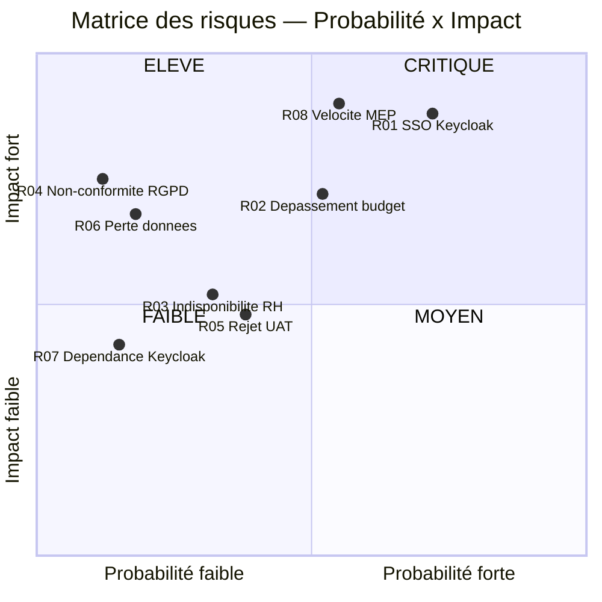

# LIVRABLE 4 - Méthodologie, Backlog priorisé & Tableau Kanban

Responsable : Développeur (DEV)   |   Contributions : Chef de Projet (priorisation), Analyste (DoR/DoD, WIP)

## 4.1 Note de choix méthodologique

### 4.1.1 Comparatif des approches

| Critère d'évaluation | Cycle en V classique | Scrum pur | Hybride (retenu) |
| --- | --- | --- | --- |
| Gestion des jalons contractuels | Jalons fixes dès le début, idéal pour engagements sponsors | Pas de jalon fixe : incompatible avec MEP M+4 contractuelle | Jalons fixes J0–J4 + sprints internes |
| Flexibilité face aux imprévus | Changement de périmètre très coûteux en cours de projet | Adaptation sprint par sprint : idéal pour périmètre incertain | Périmètre global fixe, détail évolutif par sprint |
| Gestion de l'incertitude technique (SSO, UX) | Spécifications figées dès le départ : risque de régression | Spike et prototype intégrables dans un sprint | Spike OAuth2 planifié en S1 sans remettre en cause le planning global |
| Visibilité sponsor & reporting | Reporting formel à chaque phase | Difficile à aligner avec un COPIL mensuel fixe | COPIL mensuel = 2 sprints de 2 semaines, démo à chaque COPIL |
| Taille d'équipe réduite (3 personnes) | Overhead documentaire élevé, adapté aux grandes équipes | Léger, mais risque de surcharge sans WIP explicite | Kanban WIP max 2 + rituels allégés (15 min daily) |
| Conformité budget & contrat partenaires | Budget détaillé par phase dès le début | Coût difficile à prévoir, risque de dérive | Budget par lot (WBS) + réserve aléas 10 % |
| Intégration des retours partenaires | Retours uniquement en fin de projet (UAT) | Démos fréquentes, feedback continu | Test utilisateurs M+2 + UAT à J3, intégrés dans les sprints |
| **Verdict** | **Trop rigide pour la partie SSO/UX** | **Trop imprévisible pour l'engagement M+4** | **RETENU : meilleur équilibre pour ce contexte** |

### 4.1.2 Justification du choix hybride

Après analyse du contexte projet, l'équipe a retenu une approche hybride combinant les jalons contractuels d'un cycle en V (pour répondre à l'impératif M+4 du sponsor) et les sprints Scrum de 2 semaines (pour intégrer les retours partenaires et gérer l'incertitude technique).

### 4.1.3 Détail des critères pour notre projet

| Critère de choix | Justification pour notre projet |
| --- | --- |
| Délai M+4 non négociable (contractuel) | Des jalons fixes imposés à J1, J2, J3, J4 garantissent la traçabilité des engagements vis-à-vis du sponsor. Un Scrum pur sans jalons fixes aurait été incompatible. |
| Périmètre partiellement incertain (UX, SSO) | Les sprints de 2 semaines permettent d'intégrer les retours des 5 partenaires pilotes testeurs sans remettre en cause l'ensemble du planning. |
| Équipe réduite (3 personnes) | Le Kanban avec WIP maximum de 2 par personne évite la surcharge et rend visible l'engorgement dès qu'il se produit. |
| Intégration SSO à risque élevé | Un spike technique d'une semaine a été planifié en Sprint 1 pour lever l'incertitude Keycloak avant d'engager le développement complet. |
| Reporting sponsor mensuel | La cadence COPIL mensuelle s'aligne naturellement sur 2 sprints de 2 semaines, permettant une démo à chaque COPIL. |

## 4.2 Definition of Ready (DoR) & Definition of Done (DoD)

### Definition of Ready - conditions pour qu'une story entre en sprint

- Story rédigée au format canonique : En tant que [rôle], je veux [action] afin de [bénéfice métier]

- Critères d'acceptation rédigés (format Given/When/Then) et validés par le Chef de Projet

- Estimation réalisée en points par l'équipe (Planning Poker - consensus ou ≤ 2 points d'écart)

- Maquette ou spécification disponible si la story implique une interface

- Dépendances techniques identifiées et levées (ou plan de levée documenté)

- Story tient dans un sprint (≤ 8 points) - sinon décomposition obligatoire

### Definition of Done - conditions pour qu'une story soit considérée terminée

- Code développé, revu par un pair (pull request approuvée - minimum 1 review)

- Tests unitaires écrits et passants - couverture ≥ 70 % sur les nouveaux fichiers

- Tests d'intégration ou de régression exécutés sans échec

- Documentation technique mise à jour (README, swagger API si endpoint concerné)

- Story validée en environnement de recette (pas seulement en local)

- Checklist RGPD vérifiée et cochée si la story traite des données personnelles partenaires

- Ticket Jira passé en statut « Done » avec commentaire de clôture

## 4.3 Backlog priorisé - Sprints 1 à 4

Priorisation MoSCoW : MUST = obligatoire pour MEP M+4 | SHOULD = haute valeur, inclus si possible | COULD = optionnel | WON'T = hors périmètre V1

Note : 4 retours client collectés en cours de projet (CR01-CR04) sont en attente de raffinage dans le backlog non sprinté. Ils feront l'objet d'une session de grooming avant le Sprint Planning S4 (cf. §4.4.1).

| ID | Épic | User Story | Priorité | Pts | Sprint | Statut |
| --- | --- | --- | --- | --- | --- | --- |
| US01 | SSO | En tant que partenaire, je veux me connecter via SSO (OAuth2) afin d'éviter de gérer plusieurs mots de passe | MUST | 8 | S1 | Done |
| US02 | SSO | En tant qu'admin DSI, je veux gérer les rôles et habilitations SSO afin de contrôler les accès par profil partenaire | MUST | 5 | S1 | Done |
| US03 | SSO | En tant que partenaire, je veux être redirigé automatiquement après expiration de session afin de ne pas perdre mon travail | SHOULD | 3 | S1 | Done |
| US04 | API Commandes | En tant que partenaire, je veux soumettre une commande via API REST afin d'automatiser mes flux ERP | MUST | 8 | S2 | Done |
| US05 | API Commandes | En tant que partenaire, je veux consulter le statut de ma commande en temps réel via l'API afin de piloter mes livraisons | MUST | 5 | S2 | Done |
| US06a | API Commandes | En tant que partenaire, je veux recevoir un webhook lors de chaque changement de statut afin d'être alerté sans polling | SHOULD | 3 | S2 | Done |
| US06b | API Commandes | En tant que partenaire, je veux que le webhook soit réémis avec retry en cas d'échec afin de garantir la réception côté ERP | SHOULD | 2 | S3 | Done |
| US07 | Facturation | En tant que comptable partenaire, je veux qu'une facture PDF soit auto-générée à la validation de commande afin d'éliminer la saisie manuelle | MUST | 8 | S3 | In Progress |
| US08 | Facturation | En tant que partenaire, je veux télécharger mes factures au format PDF depuis le portail afin d'archiver mes documents | MUST | 3 | S3 | In Progress |
| US09 | Facturation | En tant que comptable DSI, je veux exporter les factures en format CSV/Excel afin d'alimenter le logiciel comptable | SHOULD | 3 | S3 | To Do |
| US10 | Tableau de bord | En tant que partenaire, je veux visualiser mes KPI commandes (volume, délai, taux de succès) sur un dashboard afin de piloter mon activité | SHOULD | 5 | S4 | To Do |
| US11 | Notifications | En tant que partenaire, je veux recevoir un email récapitulatif hebdomadaire de mes commandes afin de suivre mon activité sans connexion | COULD | 3 | S4 | To Do |
| US12 | Documentation | En tant que développeur partenaire, je veux accéder à une documentation Swagger interactive afin d'intégrer l'API sans contacter le support | SHOULD | 2 | S4 | To Do |

## 4.4 Tableau Kanban - État à la date de rendu (22/05/2025)

Règle WIP : Maximum 2 stories en cours simultanément par personne - toute entrée en 'In Progress' au-delà de cette limite est bloquée jusqu'à livraison d'une story existante

Le tableau ci-dessous reflète l'intégralité des items Jira : user stories (US), tâches techniques ([Lx]) et bugs ([INC]), répartis sur les sprints S1 à S3.

### Stories & tâches terminées — DONE (16 items)

| Réf Jira | Type | Item | Sprint | Clôturé le |
| --- | --- | --- | --- | --- |
| SCRUM-86 | Tâche | [L4] PV Sprint Planning S1 + Kick-off J0 | S1 | 29/03/2025 |
| SCRUM-84 | Tâche | [L2] Architecture & specs API — J1 validé | S1 | 28/03/2025 |
| SCRUM-82 | Tâche | [L1] Note de cadrage & charte projet | S1 | 31/03/2025 |
| SCRUM-83 | Tâche | [L1] Registre des risques + budget prévisionnel | S1 | 02/04/2025 |
| SCRUM-85 | Tâche | [L2] Configuration environnements + CI/CD GitHub Actions | S1 | 04/04/2025 |
| SCRUM-79 | Story | US01 - Connexion SSO Partenaire (OAuth2 PKCE) — MUST 8 pts | S1 | 02/04/2025 |
| SCRUM-80 | Story | US02 - Gestion des rôles et habilitations SSO (Admin DSI) — MUST 5 pts | S1 | 07/04/2025 |
| SCRUM-81 | Story | US03 - Redirection automatique après expiration de session — SHOULD 3 pts | S1 | 09/04/2025 |
| SCRUM-94 | Bug | [INC] BUG-047 - SSO Keycloak HTTP 401 OAuth2 (INC-001 résolu) | S2 | 24/04/2025 |
| SCRUM-90 | Tâche | [L2] Développement API REST - Endpoints commandes & statuts | S2 | 25/04/2025 |
| SCRUM-87 | Story | US04 - Soumission de commande via API REST — MUST 8 pts | S2 | 25/04/2025 |
| SCRUM-91 | Tâche | [L3] Tests unitaires Jest/Pytest — couverture 71% (atelier 25/04) | S2 | 30/04/2025 |
| SCRUM-93 | Tâche | [L4] Rapport COPIL M+2 + revue sprint S2 — 30/04/2025 | S2 | 30/04/2025 |
| SCRUM-88 | Story | US05 - Consultation statut commande en temps réel — MUST 5 pts | S2 | 28/04/2025 |
| SCRUM-92 | Tâche | [L3] Tests d'intégration Cypress E2E (flux OAuth2 + commandes) | S2 | 05/05/2025 |
| SCRUM-89 | Story | US06a - Émission webhook changement statut commande — SHOULD 3 pts | S2 | 06/05/2025 |
| SCRUM-95 | Story | US06b - Webhook retry logic & idempotence — SHOULD 2 pts | S3 | 14/05/2025 |
| SCRUM-99 | Tâche | [L2] Module facturation — génération PDF + email + historique S3 | S3 | 16/05/2025 |
| SCRUM-100 | Tâche | [L2] Front-end React 18 — portail partenaires + dashboard commandes | S3 | 19/05/2025 |
| SCRUM-102 | Tâche | [L4] Tableau de bord KPI SPI/CPI + suivi EVM (budget 32 351€) | S3 | 21/05/2025 |

### En cours — IN PROGRESS (WIP = 2/2)

| Réf Jira | Type | Item | Sprint | Démarré le |
| --- | --- | --- | --- | --- |
| SCRUM-96 | Story | US07 - Facture PDF auto-générée à validation commande — MUST 8 pts | S3 | 19/05/2025 |
| SCRUM-97 | Story | US08 - Téléchargement PDF facture depuis le portail — MUST 3 pts | S3 | 19/05/2025 |

### À faire — TO DO sprint S3 en cours

| Réf Jira | Type | Item | Sprint |
| --- | --- | --- | --- |
| SCRUM-98 | Story | US09 - Export CSV/Excel des factures (comptabilité DSI) — SHOULD 3 pts | S3 |
| SCRUM-101 | Tâche | [L3] Recette UAT — 5 partenaires pilotes (J3 — 06/06/2025) | S3 |

### À faire — TO DO sprint S4

| Réf Jira | Type | Item | Sprint |
| --- | --- | --- | --- |
| SCRUM-103 | Story | US10 - Dashboard KPI commandes partenaire — SHOULD 5 pts | S4 |
| SCRUM-104 | Story | US11 - Email récapitulatif hebdomadaire — COULD 3 pts | S4 |
| SCRUM-105 | Story | US12 - Documentation Swagger interactive API — SHOULD 2 pts | S4 |
| SCRUM-106 | Tâche | [L5] Documentation technique API (Swagger + README + architecture) | S4 |
| SCRUM-107 | Tâche | [L5] Guide utilisateur partenaires (onboarding + FAQ + tutoriels) | S4 |
| SCRUM-108 | Tâche | [L5] Procédure MEP production + tests fumée + monitoring J4 | S4 |
| SCRUM-109 | Tâche | [L5] Bilan projet & RETEX final (clôture projet) | S4 |
| SCRUM-110 | Tâche | [L4] Rapport COPIL final + décision Go/NoGo (J4 — 30/06/2025) | S4 |

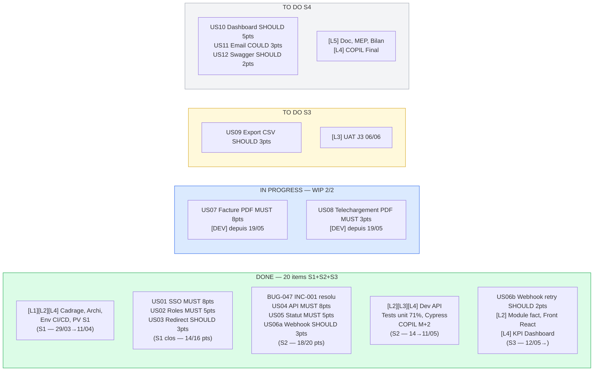

Note sur le découpage US06 : suite à la complexité de la gestion de l'idempotence des webhooks détectée en Sprint 2 (J+10 : 5,7 pts restants, blocage retry/idempotence), la décision COPROJ du 21/05 a découpé US06 en deux sous-stories : US06a (émission webhook — livré S2 le 06/05) et US06b (retry logic & idempotence — livré S3 le 14/05). Cette pratique de découpage illustre l'application du principe "stories ≤ 8 pts" de la DoR.

## 4.4.1 Backlog des retours client non priorisés (à raffiner)

En complément du backlog sprint priorisé (§4.3), le projet collecte en flux continu des retours issus des partenaires et de l'équipe interne. Ces retours arrivent via les canaux suivants : sessions UAT, feedback ERP post-intégration des webhooks, retours de la comptabilité pendant la préparation des UAT, et observations lors des dailys ou des revues UX. Ils sont remontés au COPROJ hebdomadaire, puis soumis au filtre de la DoR (rédaction de la story canonique, critères d'acceptation Given/When/Then, estimation en Planning Poker, identification des dépendances) avant toute entrée en sprint. Cette pratique de grooming continu garantit que le Sprint Planning S4 ne retient que des stories prêtes, réduisant le risque de blocage en cours de sprint (R08 — planning, §3). Elle illustre aussi concrètement pourquoi certains items MoSCoW COULD ne sont pas encore sprintés : ils sont en attente de raffinage, pas abandonnés.

Les 4 retours ci-dessous (SCRUM-111 à SCRUM-114 dans Jira) sont dans le backlog en statut "À faire", **sans attribution de sprint**, labels `client-feedback` et `to-refine`.

| Réf | Jira | Source du retour | Description | Priorité MoSCoW provisoire | État DoR | Justification non-inclusion sprint |
| --- | --- | --- | --- | --- | --- | --- |
| CR01 | SCRUM-111 | UAT partenaires pilotes (29/05/2025) | Filtrage avancé liste commandes (statut + plage de dates) | SHOULD | Estimation et maquette manquantes | Dépendance US10 (Dashboard) ; DoR incomplète |
| CR02 | SCRUM-112 | Partenaire ERP B2B (post-intégration US06a) | Signature HMAC SHA-256 sur les webhooks (validation côté ERP) | COULD | Évaluation sécurité DSI à réaliser | Validation Équipe Sécurité DSI préalable requise |
| CR03 | SCRUM-113 | Comptable DSI (préparation UAT M+3) | Filtre par période (mois/trimestre) sur l'export CSV factures | SHOULD | Estimation à réaliser | Dépendance US09 non encore livrée en S3 |
| CR04 | SCRUM-114 | Observation interne — daily 19/05/2025 | Tooltips explicatifs sur les codes statuts commande (dashboard) | COULD | Textes tooltip non arbitrés | Dépendance US10 ; effort faible (1-2 pts) mais DoR incomplète |

**Processus de raffinage prévu** : ANA convoque une session de grooming dédiée avant le Sprint Planning S4 (02/06/2025). CR01 et CR03 (priorité SHOULD) seront instruits en priorité. CR02 et CR04 (COULD) seront traités si la capacité du sprint le permet après stabilisation des MUST et SHOULD.

Lien avec le registre des risques : le risque R05 (rejet UAT partenaires — criticité 6 MOYEN, §3) est directement alimenté par ces retours. CR01 (filtrage liste commandes) et CR04 (tooltips statuts) sont des retours UX qui, s'ils restaient sans réponse, pourraient dégrader l'acceptation lors de la recette J3.

## 4.5 Procès-verbaux de réunion horodatés

### PV Sprint Planning S1 - 29 mars 2025

Date : 29 mars 2025 - 09h00 à 10h30

Animateur : Chef de Projet

Participants : Chef de Projet, Développeur, Analyste

| Rubrique | Contenu |
| --- | --- |
| Objectif du sprint | Livrer le socle SSO (US01, US02, US03) + démarrer l'API commandes (US04). Capacité équipe : 16 points. |
| Stories sélectionnées | US01 (8 pts) · US02 (5 pts) · US03 (3 pts) · US04 (8 pts) : total : 24 pts présentés, 16 pts sélectionnés (US04 dépendante de US01) |
| Décisions prises | 1/ Spike OAuth2 planifié J1 à J3 du sprint avant tout développement SSO (risque R01). 2/ WIP max = 2 par personne : règle confirmée. 3/ US04 démarrée uniquement si US01 Done avant J+8. 4/ Daily à 9h15 - 15 min max. |
| Estimation stories | US01 : 8 pts (DEV estime 7, CP estime 8, ANA estime 8 : consensus 8). US02 : 5 pts (consensus). US03 : 3 pts (consensus). US04 : 8 pts (consensus). |
| Risques identifiés en planning | R01 (SSO) activé en VIGILANCE : spike prévu pour limiter l'impact. DEV signale que la documentation Keycloak est en anglais uniquement → mobilisation C13. |
| Actions post-planning | DEV : commencer spike OAuth2 dès J+1. ANA : mettre à jour le registre R01 en statut VIGILANCE. CP : envoyer le sprint backlog validé à J+1. |

Horodatage de clôture : 29/03/2025 à 10h30 : validé par CP, DEV, ANA

---

### PV COPROJ intermédiaire - 14 avril 2025

Date : 14 avril 2025 - 09h00 à 09h45

Animateur : Chef de Projet

Participants : Chef de Projet, Développeur, Analyste

| Rubrique | Contenu |
| --- | --- |
| Avancement | Sprint 1 clôturé à 87,5 % (14/16 pts). US04 reportée en S2. Spike OAuth2 terminé, complexité confirmée mais maîtrisée. SPI = 0,88. CPI = 1,02. |
| Points positifs | Couverture de tests à 62 % dès S1. Spike OAuth2 a permis d'identifier les 4 causes racines avant le développement complet (gain estimé : 3 jours). US01, US02, US03 livrées sans régression. |
| Points de vigilance | SPI sous la cible (0,88 vs 0,95). US04 démarrée trop tard. DEV a besoin d'un atelier tests unitaires : PR rejetées (3 en S1) révèlent un manque de couverture initiale. |
| Décisions prises | 1/ Atelier tests unitaires planifié le 25/04 (DEV anime, ANA + CP participants). 2/ US04 + US05 priorisées en tête de S2 pour rattraper le retard. 3/ Alerte R01 maintenue, suivi quotidien par DEV. 4/ Sprint 2 démarre le 14/04 avec 20 pts planifiés. |
| Actions correctives | DEV : US04 à livrer avant J+5 de S2 (18/04). ANA : mettre à jour le rapport EVM (SPI = 0,88, CV positif). CP : informer le sponsor de l'ajustement prévisionnel du jalon J2 (25/04 → 28/04). |
| Prochains jalons | J2 ajusté : 28/04/2025 · Atelier tests unitaires : 25/04/2025 · COPIL mensuel : 30/04/2025. |

Horodatage de clôture : 14/04/2025 à 09h45 : validé par CP, DEV, ANA

# LIVRABLE 5 - Tableau de bord KPI & Reporting

Responsable : Analyste (ANA)   |   Contributions : Chef de Projet (décisions correctives), Développeur (données techniques)

## 5.1 Analyse par la Valeur Acquise : Earned Value Management (EVM)

Responsable : Analyste (ANA)

### Définitions des indicateurs

| Indicateur | Formule | Interprétation |
| --- | --- | --- |
| PV - Planned Value (Valeur Planifiée) | Budget Total × (% travail planifié à date) | Ce qui aurait dû être dépensé selon le plan |
| EV - Earned Value (Valeur Acquise) | Budget Total × (% travail réellement terminé à date) | Valeur du travail effectivement accompli |
| AC - Actual Cost (Coût Réel) | Σ des coûts réellement engagés à date | Ce qui a été réellement dépensé |
| CPI - Cost Performance Index | EV / AC | > 1 = sous budget · < 1 = sur budget |
| SPI - Schedule Performance Index | EV / PV | > 1 = en avance · < 1 = en retard |
| CV - Cost Variance | EV - AC | Positif = économie · Négatif = dépassement |
| SV - Schedule Variance | EV - PV | Positif = avance · Négatif = retard |

### Tableau EV/AC/PV par jalon

Budget total du projet : 32 351 €

| Jalon | Date | % Planifié (PV %) | % Réalisé (EV %) | PV (€) | EV (€) | AC (€) | CPI | SPI | CV (€) | SV (€) | Statut |
| --- | --- | --- | --- | --- | --- | --- | --- | --- | --- | --- | --- |
| J0 - Kick-off | 02/03/2025 | 5 % | 5 % | 1 618 | 1 618 | 1 590 | 1,02 | 1,00 | +28 | 0 | OK |
| J1 - Archi validée | 28/03/2025 | 22 % | 22 % | 7 117 | 7 117 | 7 050 | 1,01 | 1,00 | +67 | 0 | OK |
| Fin Sprint 1 | 11/04/2025 | 35 % | 31 % | 11 323 | 10 029 | 9 800 | 1,02 | 0,88 | +229 | −1 294 | SPI bas |
| J2 - Dev M1 (ajusté) | 28/04/2025 | 55 % | 52 % | 17 793 | 16 822 | 16 400 | 1,03 | 0,95 | +422 | −971 | Vigilance |
| Fin Sprint 2 | 11/05/2025 | 62 % | 60 % | 20 058 | 19 411 | 20 060 | 0,97 | 0,97 | −649 | −647 | INC-001 |
| Situation actuelle | 22/05/2025 | 68 % | 63 % | 22 003 | 20 381 | 20 060 | **0,97** | **0,93** | **+321** | **−1 622** | Vigilance |
| J3 - UAT (prévision) | 06/06/2025 | 82 % | / | 26 528 | / | / | cible ≥ 0,90 | cible ≥ 0,95 | / | / | Planifié |
| J4 - MEP (prévision) | 30/06/2025 | 100 % | / | 32 351 | / | / | cible ≥ 0,90 | cible ≥ 0,95 | / | - | Planifié |

*Courbe EVM — ligne 1 : PV (Valeur Planifiée) · ligne 2 : EV (Valeur Acquise) · ligne 3 : AC (Coût Réel)*

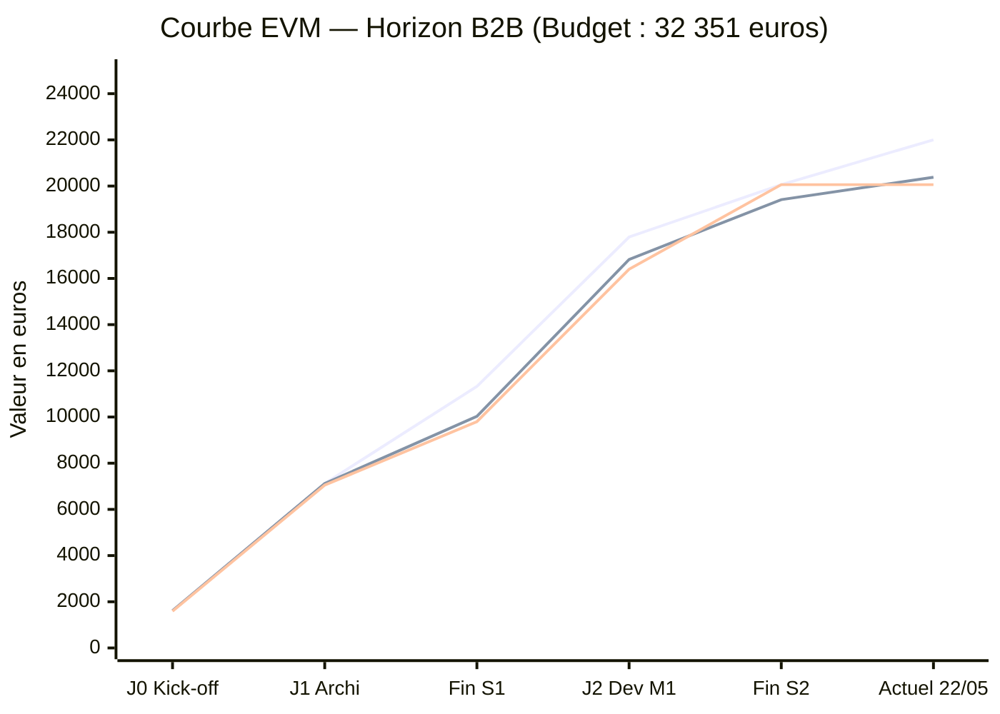

### Lecture des indicateurs actuels (22/05/2025)

- **CPI = 0,97** : pour chaque euro dépensé, 0,97 € de valeur est produite. Légère sous-performance due à l'incident INC-001 (coûts DEV absorbés). Situation saine, réserve de 2 141 € encore disponible.
- **SPI = 0,93** : le projet avance à 93 % de la vitesse planifiée. Retard cumulé estimé à 2,3 jours sur le chemin critique. En amélioration depuis la résolution de INC-001 (SPI était à 0,88 en fin S1).
- **EAC - Estimate at Completion** = AC + (BAC − EV) / CPI = 20 060 + (32 351 − 20 381) / 0,97 = **32 380 €** : dépassement estimé de 29 € vs budget (< 0,1 %). Situation sous contrôle.

## 5.2 Indicateurs de pilotage management - Situation au 22/05/2025

| Indicateur | Formule | Cible | Valeur J3-actuelle | Tendance | Statut |
| --- | --- | --- | --- | --- | --- |
| SPI (Schedule Performance Index) | Valeur Acquise / Valeur Planifiée | ≥ 0,95 | 0,93 | ↗ En amélioration (était 0,88 à J+45) | VIGILANCE |
| CPI (Cost Performance Index) | Valeur Acquise / Coût Réel | ≥ 0,90 | 0,97 | → Stable | OK |
| Coût réel vs Budget | Σ réalisé vs 32 351 € | < 100 % | 20 060 € / 62 % | → Dans enveloppe | OK |
| Taux de stories livrées (sprint) | Stories Done / Stories planifiées sprint | ≥ 85 % | 83 % (S2) | ↗ (était 75 % en S1) | VIGILANCE |
| Risques ouverts HAUTE/CRITIQUE | Nb risques criticité ≥ 6 | ≤ 2 | 2 (R01 en résolution, R02 surveillé) | ↘ En baisse | VIGILANCE |
| Conformité RGPD (DoD) | Stories avec checklist RGPD cochée / stories données perso | 100 % | 100 % (5/5 stories concernées) | → Conforme | OK |

## 5.2 Indicateurs agiles - Sprints 1 à 2 (S3 en cours)

| Indicateur | Sprint 1 (S1) | Sprint 2 (S2) | Sprint 3 (S3 - en cours) | Objectif |
| --- | --- | --- | --- | --- |
| Vélocité (points livrés) | 14 pts | 18 pts | En cours (6 pts à J+5) | ≥ 16 pts / sprint |
| Stories planifiées vs livrées | 16 pts planifiés / 14 livrés | 20 pts planifiés / 18 livrés | 18 pts planifiés | Ratio ≥ 85 % |
| Lead time moyen (To Do → Done) | 5,2 jours | 4,1 jours | En mesure | ≤ 5 jours |
| Taux de bugs détectés en recette | 4 bugs / 16 pts | 2 bugs / 18 pts | 0 à ce stade | ≤ 2 bugs / sprint |
| Couverture de tests | 62 % | 71 % | 73 % (en progression) | ≥ 70 % |
| Nombre de PR rejetées (revue code) | 3 | 1 | 0 à ce stade | ≤ 2 / sprint |

*Vélocité par sprint — barres : points livrés · ligne : cible (16 pts)*

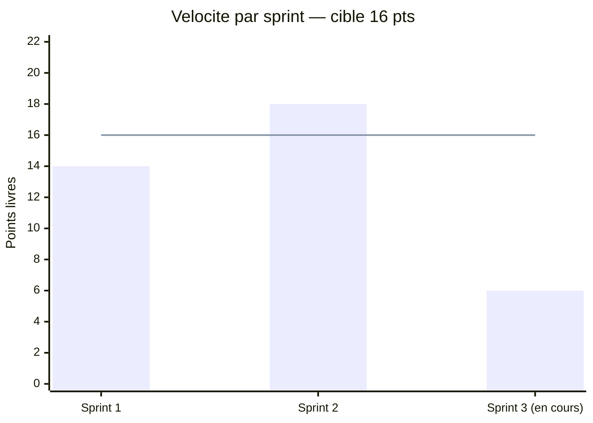

### Sprint Report — Planifié vs Livré par sprint

*Barres bleues : points planifiés (engagement) · Barres orange : points effectivement livrés (Done)*

```mermaid
xychart-beta
    title "Sprint Report — Planifie vs Livre (story points)"
    x-axis ["S1 - Socle SSO", "S2 - API Commandes", "S3 - Facturation (en cours)"]
    y-axis "Story points" 0 --> 24
    bar [16, 20, 18]
    bar [14, 18, 6]
```

Lecture : S1 — 14/16 pts livrés (87,5 % — US04 reportée S2 cause spike OAuth2) · S2 — 18/20 pts livrés (90 % — US06b reportée S3 cause complexité idempotence) · S3 — 6 pts livrés sur 18 à J+5 (sprint en cours au 22/05/2025). La progression entre S1 et S2 (+4 pts, +29 %) confirme l'effet de l'atelier tests unitaires du 25/04 et la résolution de INC-001.

### Diagramme de flux cumulé — Items terminés (cumulatif)

*Ligne : nombre cumulé d'items passés au statut "Terminé" depuis le lancement du projet*

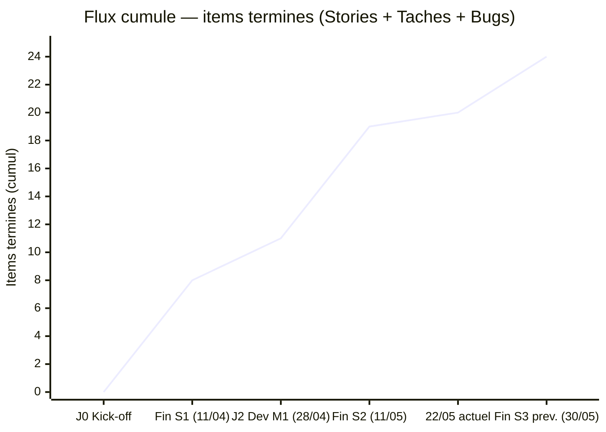

Lecture : la pente est régulière entre J0 et la fin S1 (8 items), s'accélère en S2 après résolution de INC-001 (+11 items en 4 semaines), puis ralentit légèrement en S3 (sprint en cours — 1 item terminé entre fin S2 et le 22/05, reflétant le démarrage de S3 au 12/05). L'objectif fin S3 est 24 items terminés avant l'UAT du 29/05.

### Burndown Chart - Sprint 1 (idéal vs réel)

Sprint 1 : 16 points planifiés sur 14 jours ouvrés (29/03 → 11/04/2025)

| Jour | Points restants IDÉAL | Points restants RÉEL | Événement |
| --- | --- | --- | --- |
| J+0 (29/03) | 16 | 16 | Lancement Sprint 1 |
| J+1 (31/03) | 14,9 | 16 | Démarrage, spike OAuth2 |
| J+2 (01/04) | 13,7 | 14 | US03 démarrée |
| J+3 (02/04) | 12,6 | 12 | US01 livrée (8 pts) |
| J+4 (03/04) | 11,4 | 12 | Aucune livraison |
| J+5 (04/04) | 10,3 | 10 | US02 livrée (5 pts - partiel) |
| J+6 (07/04) | 9,1 | 8 | US02 clôturée, US03 en cours |
| J+7 (08/04) | 8,0 | 8 | Spike OAuth2, complexité détectée |
| J+8 (09/04) | 6,9 | 5 | US03 livrée (3 pts) |
| J+9 (10/04) | 5,7 | 5 | US04 démarrée : trop tardif |
| J+10 (11/04) | 4,6 | 4 | Clôture : US04 non livrée (2 pts restants) |
| **Résultat** | **0 pts attendus** | **2 pts non livrés** | **SPI = 0,88, US04 reportée S2** |

*Burndown S1 — ligne 1 : progression idéale · ligne 2 : progression réelle*

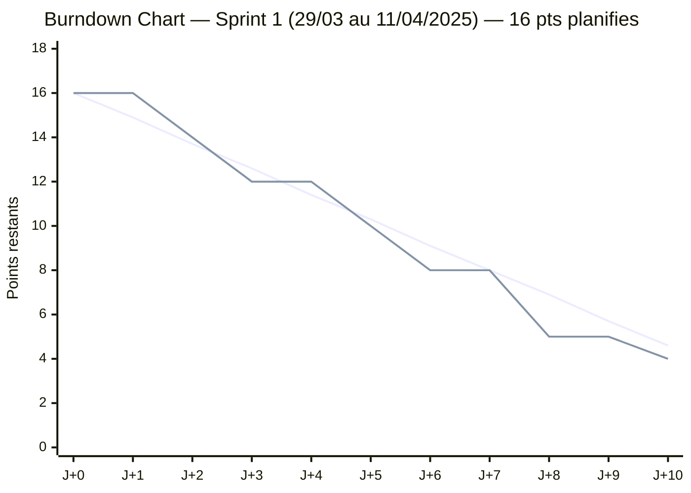

Analyse burndown S1 : Démarrage conforme jusqu'à J+6, puis ralentissement causé par la complexité du spike OAuth2 (risque R01). L'équipe a livré 14 pts sur 16 planifiés. US04 (8 pts) a été démarrée trop tardivement pour être finalisée dans le sprint.

### Burndown Chart - Sprint 2 (idéal vs réel)

Sprint 2 : 20 points planifiés sur 14 jours ouvrés (14/04 → 09/05/2025, décalé au 11/05)

| Jour | Points restants IDÉAL | Points restants RÉEL | Événement |
| --- | --- | --- | --- |
| J+0 (14/04) | 20 | 20 | Lancement Sprint 2, INC-001 ouvert |
| J+1 (15/04) | 18,6 | 20 | Blocage SSO, aucune livraison |
| J+2 (22/04) | 17,1 | 20 | INC-001 détecté (14h37) : priorité HIGHEST |
| J+3 (23/04) | 15,7 | 20 | Résolution INC-001 en cours |
| J+4 (24/04) | 14,3 | 20 | INC-001 clôturé (11h00) : 0 pt livré |
| J+5 (25/04) | 12,9 | 16 | Atelier tests + US04 livrée (8 pts) |
| J+6 (28/04) | 11,4 | 11 | US05 livrée (5 pts) |
| J+7 (29/04) | 10,0 | 11 | Consolidation tests |
| J+8 (30/04) | 8,6 | 8 | US06 démarrée : 3 pts story |
| J+9 (05/05) | 7,1 | 5 | Avancement US06 |
| J+10 (06/05) | 5,7 | 5 | Complexité retry/idempotence détectée |
| J+11 (07/05) | 4,3 | 3 | Revue de code collaborative |
| J+12 (08/05) | 2,9 | 2 | US06 : découpage US06a/US06b décidé |
| J+13 (09/05) | 1,4 | 2 | US06a non finalisée |
| J+14 (11/05) | 0 | 2 | Clôture : US06 (2 pts) reportée S3 |
| **Résultat** | **0 pts attendus** | **2 pts non livrés** | **SPI = 0,93 en amélioration** |

*Burndown S2 — ligne 1 : progression idéale · ligne 2 : progression réelle*

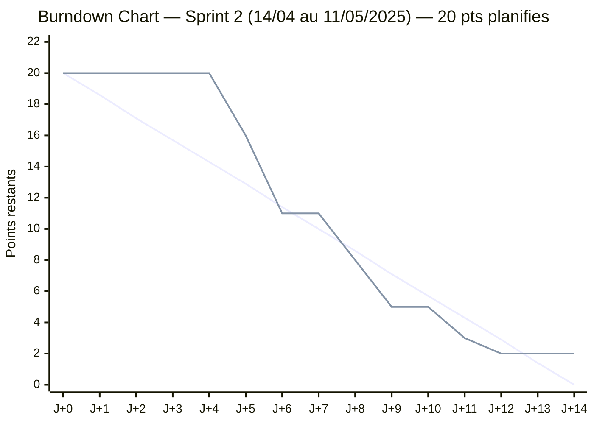

Analyse burndown S2 : La courbe burndown du Sprint 2 montre un démarrage lent (J+1 à J+4 : seulement 0 pts livrés sur ~6 attendus) dû à l'incident SSO (INC-001). Accélération notable à partir de J+5 après résolution. La vélocité de 18 pts confirme la capacité de l'équipe une fois les blocages levés. Le retard restant (US06) est dû à la complexité de la gestion de l'idempotence des webhooks, non liée à INC-001.

## 5.3 Rapport d'étape - Sprint 1 (clôture : 11/04/2025)

Date de rédaction : 11 avril 2025

Rédacteur : Analyste (ANA)

Période couverte : 29/03/2025 → 11/04/2025

| Rubrique | Contenu |
| --- | --- |
| Avancement global | Sprint 1 clôturé à 87,5 % : 14 pts livrés sur 16 planifiés. 3 stories Done (US01, US02, US03). US04 démarrée mais non livrée (repoussée en S2). SPI de fin de sprint : 0,88. |
| KPI période | SPI = 0,88 (cible ≥ 0,95) · CPI = 1,02 (cible ≥ 0,90) · Vélocité : 14 pts · Couverture tests : 62 % · Bugs recette : 4 · PR rejetées : 3 |
| Valeur acquise (EV) | EV = 8 750 € (14/16 pts × valeur planifiée S1) · AC = 8 561 € · PV = 9 956 € |
| Risques actifs | R01 (SSO Keycloak) : VIGILANCE : spike technique réalisé mais complexité OAuth2 sous-estimée. Probabilité de retard J2 estimée à 40 %. R02 (budget) : NON ACTIF, CPI > 1 en S1. |
| Décisions prises | 1/ US04 (soumission commande API) déplacée de S1 vers S2 pour permettre la stabilisation du spike SSO. 2/ Spike OAuth2 étendu de 3 jours (budget R01 utilisé à 30 %). 3/ Revue de code collaborative planifiée pour S2. |
| Points d'attention | Vélocité S1 (14 pts) inférieure à la cible (16 pts), à surveiller. PR rejetées (3) révèlent un besoin de formation revue de code. Taux de bugs (4/sprint) trop élevé : atelier tests unitaires planifié le 25/04. |
| Prochaines actions | DEV : livrer US04 et US05 en S2 (10 pts SSO). DEV : atelier tests unitaires le 25/04. ANA : mettre à jour le registre des risques R01. CP : ajuster le planning S2 pour absorber le flottement SSO. |
| Prochains jalons | J2 - Livraison Dev M1 : 25/04/2025 (sous surveillance). COPIL mensuel : 30/04/2025. |

## 5.4 Revue d'étape - Compte-rendu COPROJ du 21/05/2025

Date : 21 mai 2025 - 9h00 à 9h45

Animateur : Chef de Projet

Participants : Chef de Projet, Développeur, Analyste

Excusés : Sponsor (représenté par CP pour la synthèse)

| Rubrique | Contenu |
| --- | --- |
| Avancement global | Sprint 2 clôturé à 90 % (18/20 pts). 4 stories Done (US01 à US05). Sprint 3 lancé le 19/05 - 6 pts livrés sur 18. SPI = 0,93 en amélioration. |
| Points positifs | Résolution complète de l'incident SSO en 48h (INC-001). Couverture de tests passée de 62 % à 71 % grâce à l'atelier du 25/04. Vélocité en hausse (+4 pts entre S1 et S2). |
| Points de vigilance | US06 (webhook) en retard de 5 jours - décision de découpage prise. SPI encore sous la cible (0,93 vs 0,95). Recette UAT partenaires à planifier avant fin mai. |
| Décisions actées | 1/ US06 découpée en US06a + US06b (validé). 2/ Test utilisateur UAT planifié le 29/05 avec 5 partenaires pilotes. 3/ Revue sécurité RGPD confirmée au J3 (06/06). |
| Actions correctives | DEV : livrer US06a avant le 26/05. ANA : envoyer convocations UAT partenaires avant le 23/05. ANA : organiser session de grooming des 4 retours client CR01-CR04 (SCRUM-111 à 114) avant Sprint Planning S4 du 02/06 — prioriser CR01 et CR03 (SHOULD). CP : mettre à jour le planning et notifier le sponsor de l'ajustement J2. |
| Prochains jalons | J3 - Recette UAT validée : 06/06/2025. J4 - MEP Go/NoGo : 30/06/2025. |

## 5.4 Plan d'actions correctives - C12.2

Responsable : Analyste (ANA)   |   Contributions : Chef de Projet (décisions), Développeur (données techniques)

Les trois scénarios ci-dessous couvrent les principaux types d'écarts identifiables sur le projet.

### Scénario 1 - Retard planning (SPI < 0,95)

| Champ | Détail |
| --- | --- |
| Écart identifié | SPI = 0,93 à J+60 : 7 % en dessous de la cible de 0,95. Retard cumulé de 3 jours sur le chemin critique (lot Dev, lot Tests). |
| Cause racine | Incident INC-001 (SSO) ayant bloqué 4 points de vélocité en Sprint 2. Sous-estimation du spike OAuth2 en Sprint 1. |
| Action corrective 1 | Découpage des stories longues (> 5 pts) en sous-stories livrables (US06a / US06b) pour débloquer les livraisons partielles. |
| Action corrective 2 | Ajustement du jalon J2 de 25/04 → 28/04 (absorbé dans le flottement du chemin critique). Notification sponsor par CP. |
| Action corrective 3 | Augmentation du WIP temporaire à 3 pour le lot DEV uniquement, sur autorisation CP, pendant 1 sprint. |
| Responsable | Chef de Projet |
| Délai de mise en œuvre | 48 h après détection de l'écart |
| KPI de suivi | SPI ≥ 0,95 au prochain sprint review. Vélocité cible : 18 pts minimum. |
| Seuil d'escalade | Si SPI < 0,88 sur 2 sprints consécutifs → présentation au COPIL avec arbitrage de périmètre (MoSCoW COULD supprimé). |

### Scénario 2 - Dépassement budgétaire (CPI < 0,90)

| Champ | Détail |
| --- | --- |
| Écart identifié | CPI < 0,90 : pour chaque euro dépensé, moins de 0,90 € de valeur est produite. Dépassement potentiel de l'enveloppe de 32 351 €. |
| Cause racine | Charges DEV sous-estimées sur le lot SSO (risque R01) et/ou dépassement sur les licences/infrastructure (risque R02). |
| Action corrective 1 | Activation immédiate de la réserve pour aléas (2 941 €) sur arbitrage CP + Sponsor. |
| Action corrective 2 | Gel des stories MoSCoW COULD (US11 Email récap, US12 Doc Swagger) pour libérer de la capacité DEV sans impact MEP. |
| Action corrective 3 | Renegociation du TJM DEV si dépassement > 10 % : passage de 500 €/j à 480 €/j sur les jours restants (économie estimée : 400 €). |
| Responsable | Analyste + Chef de Projet |
| Délai de mise en œuvre | Décision en COPIL sous 7 jours |
| KPI de suivi | CPI ≥ 0,90 au jalon suivant. Budget consommé < 95 % de l'enveloppe à M+3. |
| Seuil d'escalade | Si CPI < 0,85 → présentation au COMEX avec demande d'avenant budgétaire ou réduction de périmètre contractualisée. |

### Scénario 3 - Dette technique (couverture tests < 70 % ou bugs récurrents)

| Champ | Détail |
| --- | --- |
| Écart identifié | Couverture de tests < 70 % sur un nouveau lot OU ≥ 4 bugs de sévérité HAUTE détectés en recette sur un sprint. |
| Cause racine | Pression planning incitant à livrer sans tests suffisants. Manque de maîtrise TDD sur les nouvelles fonctionnalités (facturation, webhook). |
| Action corrective 1 | Blocage de la story en « Done » : la DoD exige couverture ≥ 70 % : toute story non conforme est renvoyée en « In Progress ». |
| Action corrective 2 | Organisation d'une revue de code collaborative dédiée au lot en défaut dans les 5 jours suivant la détection. |
| Action corrective 3 | Ajout d'un gate qualité SonarQube dans la CI/CD : le pipeline bloque tout merge si la couverture descend sous 70 % ou si le nombre de code smells augmente de > 20 %. |
| Responsable | Développeur (technique) + Chef de Projet (décision go/no-go) |
| Délai de mise en œuvre | Correction obligatoire avant fin du sprint en cours |
| KPI de suivi | Couverture ≥ 70 % à chaque rapport CI/CD. Taux de bugs recette ≤ 2 / sprint. Duplications code < 8 % (SonarQube). |
| Seuil d'escalade | Si couverture < 60 % → sprint de stabilisation dédié (pas de nouvelle feature) validé par le CP et le Sponsor. |

# LIVRABLE 6 - Journal de résolution d'incident (INC-001)

Responsable : Développeur (DEV)   |   Contributions : Analyste (documentation), Chef de Projet (décision)

## 6.1 Fiche incident - Identification & Description

| Champ | Valeur |
| --- | --- |
| ID Incident | INC-001 |
| Date & heure de détection | 22 avril 2025 - 14h37 |
| Détecté par | Développeur lors des tests d'intégration SSO en environnement de recette |
| Sévérité initiale | CRITIQUE - bloquant pour la livraison du Sprint 2 (jalon J2) |
| Environnement impacté | Environnement de recette uniquement - production non affectée |
| Description technique | Erreur HTTP 401 (Unauthorized) systématique lors de l'échange de token OAuth2 entre le portail B2B et le serveur SSO Keycloak. La page de connexion SSO s'affiche correctement mais la redirection post-authentification échoue. Les logs Keycloak indiquent : 'Invalid redirect_uri' et 'CORS policy blocked'. |
| Impact métier | Aucun partenaire ne peut s'authentifier en environnement de recette. Blocage total des tests d'intégration SSO. Risque de retard sur le jalon J2 (28/04/2025). |
| Ticket Jira | BUG-047 - assigné au Développeur - priorité HIGHEST |

## 6.2 Recherche documentaire - Sources consultées

| # | Source | Langue | URL / Référence | Contenu exploité pour la résolution |
| --- | --- | --- | --- | --- |
| S1 | RFC 6749 - The OAuth 2.0 Authorization Framework | EN | tools.ietf.org/html/rfc6749 | Section 4.1.2 : vérification du paramètre redirect_uri - doit être identique à l'URI enregistrée. Identification d'un encodage URL incorrect (espace → %20 vs +). |
| S2 | MDN Web Docs - Cross-Origin Resource Sharing (CORS) | EN | developer.mozilla.org/en-US/docs/Web/HTTP/CORS | Configuration des headers Access-Control-Allow-Origin et Access-Control-Allow-Credentials côté API Express - absence du header credentials identifiée. |
| S3 | Stack Overflow - Question #45287611 | EN | stackoverflow.com/q/45287611 | Cas similaire : token invalide si clock skew (décalage horloge) > 5 secondes entre le serveur applicatif et Keycloak. Résolution par synchronisation NTP. |
| S4 | Documentation Keycloak 21.x - Realm Settings | EN | keycloak.org/docs/21.0/server_admin/ | Configuration du 'Valid Redirect URIs' dans le client Keycloak - wildcard interdit en production, URI exacte requise par realm. |
| S5 | Wiki interne DSI - Guide d'installation Keycloak recette | FR | Confluence interne (page : /keycloak/recette) | Paramétrage spécifique du tenant de recette : port 8443 vs 443 en production - différence non documentée dans les specs initiales. |

## 6.3 Analyse des causes racines

| Cause racine | Type | Description |
| --- | --- | --- |
| C1 - redirect_uri mal encodée | Technique | L'URI de redirection envoyée dans la requête OAuth2 contenait des espaces encodés en '+' (format form-urlencoded) au lieu de '%20' (format URL). Keycloak rejette toute URI ne correspondant pas exactement à l'URI enregistrée dans le realm. |
| C2 - Header CORS manquant | Configuration | Le middleware Express ne renvoyait pas le header 'Access-Control-Allow-Credentials: true' pour les requêtes cross-origin, empêchant le navigateur d'envoyer les cookies de session SSO. |
| C3 - Clock skew de 8 secondes | Infrastructure | Un décalage de 8 secondes existait entre l'horloge du serveur de recette et celle du serveur Keycloak. Keycloak invalide les tokens dont le timestamp dépasse ±5 secondes. |
| C4 - URI Keycloak port 8443 non documentée | Documentation | La différence de port entre l'environnement de recette (8443) et la production (443) n'était pas documentée dans les specs d'intégration, conduisant à une configuration initiale incorrecte. |

## 6.4 Options de résolution étudiées & Décision

| Option | Description | Avantages | Inconvénients | Décision |
| --- | --- | --- | --- | --- |
| O1 - Corriger l'encodage redirect_uri | Modifier le paramètre dans le code front-end (encodeURIComponent) et dans la configuration Keycloak realm | Rapide (2h), sans impact architecture, corrige la cause C1 | Nécessite un redéploiement de recette | RETENU |
| O2 - Corriger les headers CORS | Ajouter le middleware cors() avec credentials:true dans Express + configurer Keycloak Web Origins | Corrige la cause C2, pratique standard | Test de non-régression nécessaire sur les autres endpoints | RETENU |
| O3 - Synchroniser NTP | Configurer ntpd sur le serveur de recette pour synchroniser avec pool.ntp.org | Corrige la cause C3 durablement, bonne pratique infra | Requiert accès admin serveur - délai 4h (ticket infra) | RETENU |
| O4 - Documenter URI Keycloak recette | Mettre à jour le wiki interne et le README avec les ports spécifiques par environnement | Prévient la récurrence sur les nouveaux membres | Action curative documentaire uniquement | RETENU |
| O5 - Passer en Implicit Flow OAuth2 | Contournement rapide sans échange de token côté serveur | Débogage plus simple à court terme | Déprécié dans OAuth 2.1, moins sécurisé, non conforme RGPD pour les données partenaires | ECARTE |

## 6.5 Plan d'actions correctives & Mitigation

| Action | Type | Responsable | Délai | Statut |
| --- | --- | --- | --- | --- |
| Corriger encodeURIComponent dans le front-end React et mettre à jour l'URI Keycloak realm | Correctif | DEV | 22/04 - 16h00 | Réalisé |
| Ajouter cors({ credentials: true }) + configurer Web Origins Keycloak | Correctif | DEV | 22/04 - 18h00 | Réalisé |
| Ticket infra : synchronisation NTP serveur de recette (ntpd + pool.ntp.org) | Correctif infra | DEV + Infra | 23/04 - 10h00 | Réalisé |
| Mettre à jour le wiki Confluence et le README avec les ports par environnement | Documentation | ANA | 24/04 EOD | Réalisé |
| Ajouter un test automatisé E2E (Cypress) vérifiant le flux OAuth2 complet à chaque déploiement | Prévention | DEV | Sprint 3 | En cours |
| Intégrer la checklist CORS/SSO dans la DoD pour toutes les stories d'authentification | Process | CP | Sprint 3 - S1 | Réalisé |
| Présenter l'incident en rétrospective S2 pour partage d'expérience équipe | RETEX | DEV | Rétro S2 - 30/04 | Réalisé |

Clôture incident : INC-001 clôturé le 24 avril 2025 à 11h00 - validé par le Développeur et le Chef de Projet. Durée totale de résolution : 44 heures. Perte de vélocité estimée : 4 points de story. Absorbée par la réserve de risques (R01).

# LIVRABLE 7 - Plan de montée en compétences (C15)

Responsable : Développeur (DEV)   |   Contributions : Chef de Projet (planification), Analyste (indicateurs d'impact)

## 7.1 Diagnostic initial des besoins (réalisé le 07/03/2025)

| Membre | Compétence évaluée | Niveau initial (auto-évaluation 1-5) | Niveau cible M+4 | Méthode de montée |
| --- | --- | --- | --- | --- |
| Développeur | Tests unitaires automatisés (Jest / Pytest) | 2 / 5 - Notions théoriques, peu de pratique | 4 / 5 - Autonome sur un projet complexe | Atelier pratique + revue de code |
| Développeur | OAuth2 / OIDC - protocoles d'authentification | 2 / 5 - Connaît le concept, jamais implémenté | 4 / 5 - Capable d'implémenter et déboguer | Lecture doc EN + incident réel (INC-001) |
| Analyste | Lecture et synthèse de documentation technique EN | 3 / 5 - Comprend mais lentement | 4 / 5 - Fluide sur les docs de référence RFC/MDN | Micro-formation + exercices pratiques |
| Chef de Projet | Jira avancé (filtres JQL, dashboards, automatisations) | 2 / 5 - Utilisation basique boards & tickets | 4 / 5 - Crée dashboards KPI et automatisations | Tutoriels + pratique projet réel |

## 7.2 Plan d'animation des sessions

| Session | Type | Contenu détaillé | Animateur | Date réalisée | Durée | Participants |
| --- | --- | --- | --- | --- | --- | --- |
| S1 - Atelier Tests Unitaires | Atelier pratique | Écriture de tests Jest sur le module d'authentification SSO. Concepts : mocks, stubs, couverture de code. Exercice : atteindre 70 % de couverture sur auth.service.js | DEV | 25/04/2025 | 2h00 | DEV, CP, ANA |
| S2 - Revue de code collaborative | Revue croisée | Relecture du code API REST (routes, contrôleurs, middlewares) par ANA et CP. Focus : lisibilité, nommage des variables, élimination des duplications, respect des conventions REST | DEV | 07/05/2025 | 1h15 | DEV, CP, ANA |
| S3 - RETEX Sprint 2 + Incident SSO | Rétrospective | Format Start/Stop/Continue. Analyse détaillée de l'incident INC-001 : causes, résolution, enseignements. Vote sur les 3 actions d'amélioration prioritaires | CP | 30/04/2025 | 1h00 | DEV, CP, ANA |
| S4 - Micro-formation Documentation EN | Formation courte | Exercice pratique : lire la RFC 6749 (OAuth2) sections 1 à 4, identifier les 5 concepts clés, rédiger une fiche de synthèse en français en 45 minutes | ANA | 14/05/2025 | 45 min | ANA, DEV |
| S5 - Jira Avancé | Formation courte | Configuration de dashboards KPI (SPI, CPI, vélocité), création de filtres JQL pour le suivi des risques et des stories bloquées, mise en place d'une automatisation d'alerte WIP | CP | 16/05/2025 | 1h00 | CP, ANA |

## 7.3 Indicateurs d'impact - Mesures avant / après

| Indicateur | Mesure | Valeur AVANT (07/03) | Valeur APRÈS (22/05) | Évolution | Source de mesure |
| --- | --- | --- | --- | --- | --- |
| Couverture tests automatisés | % de lignes couvertes (Jest/Pytest) | 38 % | 73 % | + 35 pts ↑ | Rapport Jest CI/CD |
| Taux de bugs détectés en recette | Nombre de bugs / sprint | 4 bugs / sprint (S1) | 2 bugs / sprint (S2) | - 50 % ↓ | Jira - filtre BUG |
| Duplications de code | % de code dupliqué (analyse SonarQube) | 12 % | 6 % | - 50 % ↓ | SonarQube dashboard |
| PR rejetées en revue | Nombre de pull requests refusées / sprint | 3 PR refusées (S1) | 1 PR refusée (S2) | - 67 % ↓ | GitHub PR history |
| Compréhension doc technique EN | Score quiz auto-évaluation (sur 10) | 5,2 / 10 (ANA + DEV) | 7,8 / 10 | + 2,6 pts ↑ | Quiz interne Notion |
| Lead time moyen To Do → Done | Jours ouvrés par story | 5,2 jours (S1) | 4,1 jours (S2) | - 1,1 j ↓ | Jira - cycle time |

Bilan intermédiaire : Les 5 sessions réalisées ont produit des effets mesurables et cohérents entre eux : la couverture de tests (+35 pts) explique directement la baisse des bugs en recette (-50 %) et la réduction des PR rejetées (-67 %). La montée en compétences sur OAuth2, acquise en partie via l'incident INC-001, a permis une résolution autonome sans recours à un prestataire externe, économisant environ 1 500 € de budget.

## 7.4 Fiches RETEX - Synthèse des feedbacks (S3 - Sprint 2)

| Question RETEX | Développeur | Chef de Projet | Analyste |
| --- | --- | --- | --- |
| Ce qui a bien fonctionné | La résolution collective de l'incident SSO - on a tous appris quelque chose de concret | Le daily stand-up : 15 min suffisent, on détecte les blocages tôt | Le dashboard Jira mis en place en S5 - visibilité KPI immédiate |
| Ce qui doit s'améliorer | Les specs d'intégration doivent documenter les différences d'environnement dès le départ | Mieux estimer les stories techniques (Planning Poker insuffisant pour les spikes) | Les revues de code doivent être planifiées, pas improvisées |
| Compétence renforcée | Tests unitaires : maintenant à l'aise avec les mocks Jest | Lecture du CPI/SPI : je comprends vraiment ce que ça dit | Lecture documentation technique EN : plus rapide et confiante |
| Application concrète | J'applique les tests dès l'écriture du code (TDD partiel) | J'anticipe les alertes budget dès que le CPI descend sous 0,95 | Je consulte d'abord la documentation officielle EN avant les forums FR |
